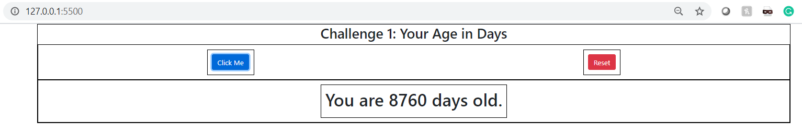

## Summary

###### This repository contains various Javascript challenges related to different levels:
* **Challenge 1: Your age in days  - Beginner Level**
    * HTML, CSS focused +Basic JS
    * Click Me: Calculates age in days considering the year as input
      
    * Reset: Resets the displayed text
      
* **Challenge 2: Cat Generator - Beginner Level**
    * HTML, CSS focused +Basic JS
    * Generate Cat: Generates Cat images in a ppleasable and formattted containers.
      
* **Challenge 3: Rock, Paper and Scissors Game - Intermediate Level**
   * HTML,CSS + More focus on JS
   * User chooses among stone, paper or scissors and then system makes a random choice; after which result is displayed
     
* **Challenge 4: Change Button colors - Intermediate Level**
   * HTML,CSS + More focus on JS
   * User chooses from dropdown the final color of buttons
     
* **Challenge 5: Black Jack Game - Intermediate Level**
   * HTML, CSS and JS methods/events
   * General BlackJack game with following functionalities:
	 * Hit(Player plays), Stand(System Plays) and Deal(Reset A round) functions
	 * Display number of wins, losses and draws
	 * Added some sound effects too
     