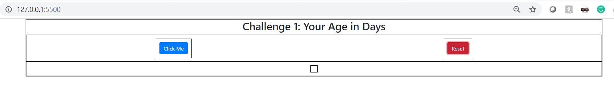

## Summary

###### This repository contains various Javascript challenges related to different levels:
* **Challenge 1: Your age in days  - Beginner Level**
    * HTML, CSS focused +Basic JS
    * Click Me: Calculates age in days considering the year as input
      
    * Reset: Resets the displayed text
      
* **Challenge 2: Cat Generator - Beginner Level**
    * HTML, CSS focused +Basic JS
    * Generate Cat: Generates Cat images in a ppleasable and formattted containers.
      
